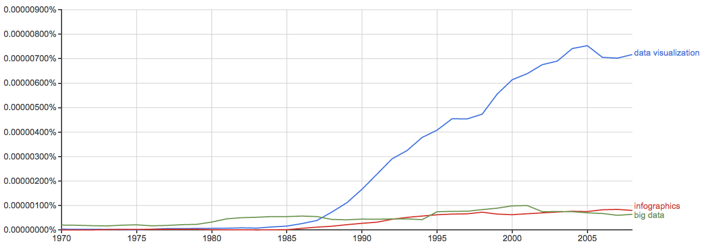
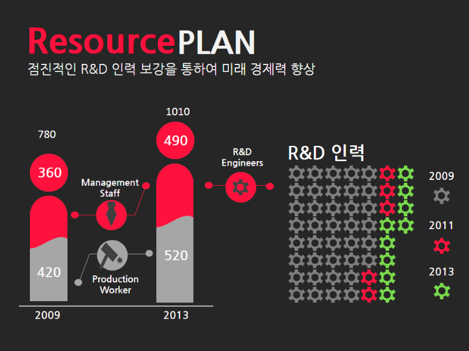
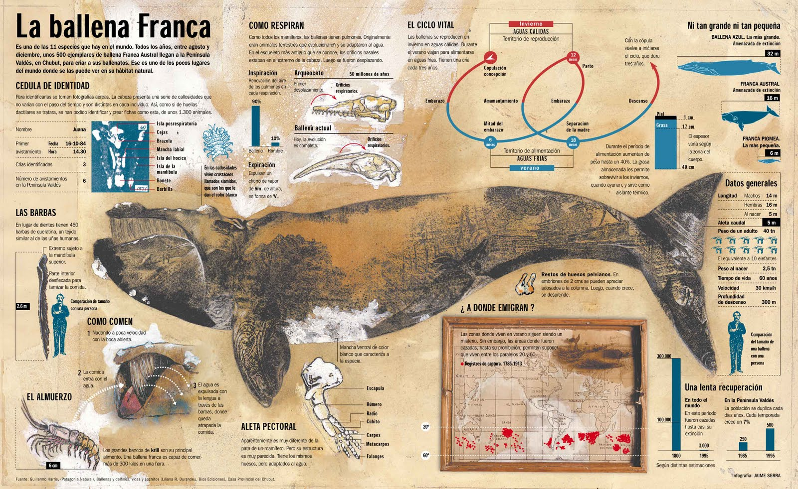
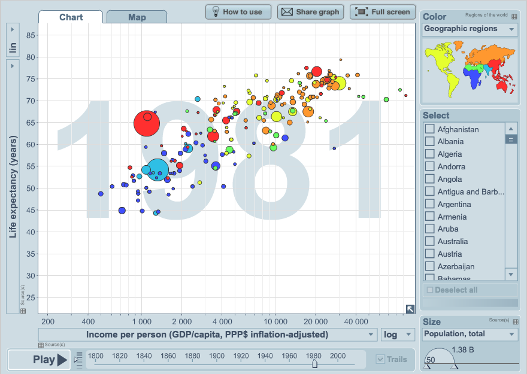
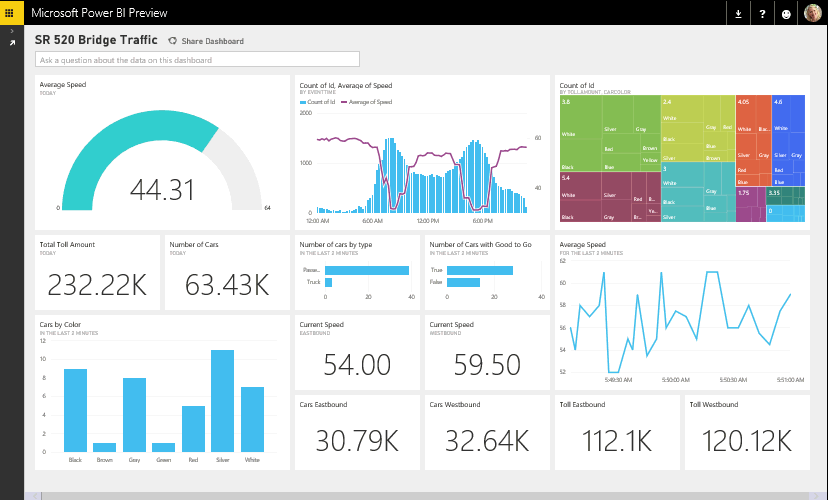
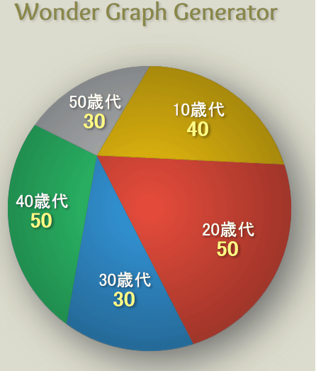
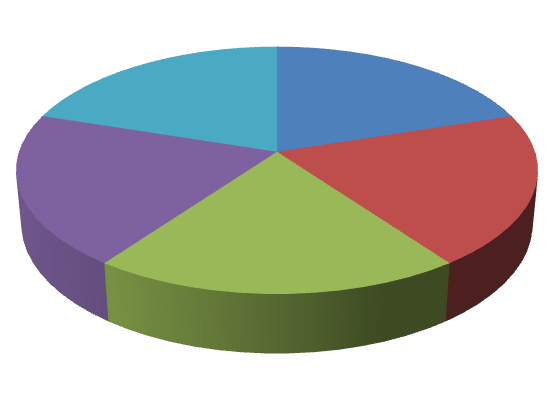
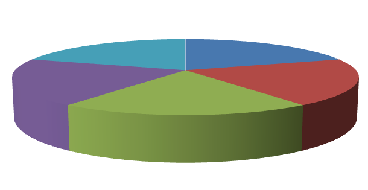
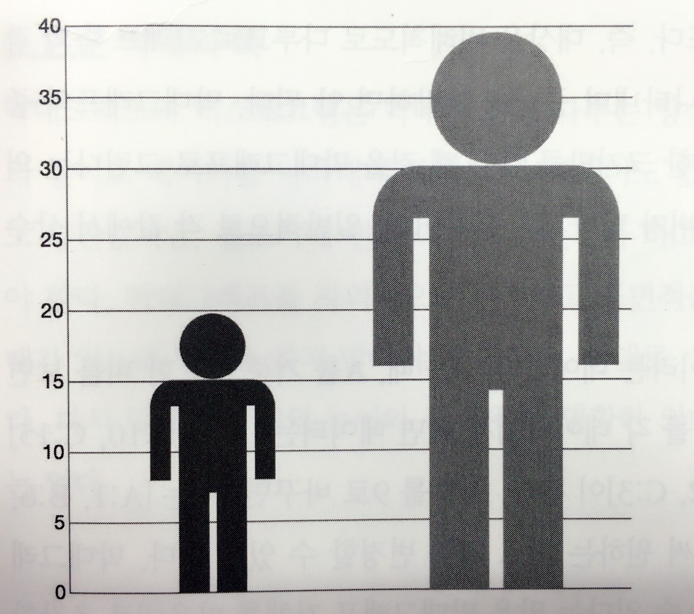

class: middle, center

<p>
<span class="title">
<strong>D3를 활용한 데이터 시각화 방법</strong>
</span>
</p>

---

## 목차

### 1. 데이터 시각화란
### 2. 데이터 시각화의 종류
### 3. 차트(그래프)의 종류
### 4. 시각화에서 자주하는 실수들
### 5. D3 기본
### 6. 재사용 가능한 차트 구현 방법

---

class: middle, center


## 1. 데이터 시각화란

---
class: middle, center


<p class="highlight">
❝<br>
데이터 시각화(Data Visualization)는<br> 
분석된 데이터의 결과를 쉽게 이해할 수 있도록<br> 
시각적으로 표현하고 전달되는 과정을 말한다.<br>
❞<br>
<span style="display:block;text-align:right;margin-right:80px;font:0.8em normal;">
- wikipedia
</span>
</p>

---

class: middle, center


<p class="highlight">
❝<br>
데이터 시각화(Data Visualization)는<br> 
분석된 데이터의 결과를 쉽게 이해할 수 있도록<br> 
시각적으로 표현하고 전달되는 과정을 말한다.<br>
❞<br>
<span style="display:block;text-align:right;margin-right:80px;font:0.8em normal;">
- wikipedia
</span>
</p>


<div style="width:746px;position:absolute;">
<p style="color: #f10000;opacity:0.8;font-size: 1.4em;">
    <strong>정보를 시각적 요소로 변환하는 작업</strong>
</p>
<p style="text-align:left">
가공되지 않은 데이터를 사람이 이해하기 쉬운 시각적 형태로 변환하고 
이를 활용해서 비즈니스를 성공적으로 수행하는데 도움을 줄 수 있다.
</p>


</div>


---

### 데이터 시각화가 시작된 시기

<p style="margin-top:120px;">
<span style="display:inline-block;background:#eee;padding:10px 10px 5px 10px;">

</span>

<span style="display:block;text-align:right;margin-right:0px;font:0.6em normal;">
- 구글 N그램 뷰어
</span>
</p>


.footnote[.red.bold[*] 구글이 수만권의 책의 텍스트를 데이터화 시켜놓음으로써 인류가 어떤 문장과 단어들을 주로 사용 했는지 살펴 볼수 있는 검색 기술]

---

### 데이터 시각화가 중요한 이유


<p class="highlight" style="text-align:center;margin-top:120px;">
❝<br>
인간의 가장 강력한 감각 기관인 눈은<br> 
냄새, 소리, 맛, 촉감을 위한 기관보다<br/> 
대역폭과 처리 능력이 훨씬 더 크다.<br>
<br>
그러므로 정보시각화를 통한 데이터 표현은<br>
인간의 가장 강력한 지각 능력을<br/> 
최대한 효과적으로 활용하는 방법이다.<br/>
❞<br>
<span style="display:block;text-align:right;margin-right:80px;font:0.8em normal;">
- 애덤페러, 아름다운시각화 中
</span>
</p>


---

### 데이터시각화의 7가지 단계


<p class="highlight" style="text-align:center;margin-top:200px;">
데이터시각화의 7가지 단계<br/>
<br/>
<span style="font-size:0.8em">
데이터 획득 - 분석 - 선별 - 데이터마이닝 - 표현 - 개선 - 상호작용
<span><br/><br/>
<span style="display:block;text-align:right;margin-right:80px;font:0.8em normal;">
- 벤 프라이[Ben Fry], Visualizing Data
</span>
</p>


---

### 데이터시각화의 7가지 단계


<p class="highlight" style="text-align:center;margin-top:200px;">
데이터시각화의 7가지 단계<br/>
<br/>
<span style="font-size:0.8em">
데이터 획득 - 분석 - 선별 - 데이터마이닝 - <span class="red">표현</span> - <span class="red">개선</span> - <span class="red">상호작용</span>
<span><br/><br/>
<span style="display:block;text-align:right;margin-right:80px;font:0.8em normal;">
- 벤 프라이[Ben Fry], Visualizing Data
</span>
</p>


---


class: middle, center

## 2. 데이터 시각화의 종류


---

### 인포그래픽(계속)

<p >
- 어떤 주제에 대해서 하나 또는 그 이상의 특정한 측면을 
설명하고 의사소통하는 데 초점을 둔 데이터 시각화의 한 형태
</p>

<p style="text-align:center;">
<span style="display:inline-block;background:#eee;padding:10px 10px 10px 10px;width:607px;text-align:center;">

</span>
</p>

<span style="margin-left:70px">
.footnote[http://blog.kolon.com/225]
</span>
---

### 인포그래픽

<p>
- 1995년 제이미 세라의 참고래에 대한 인포그래픽
</p>

<p style="text-align:center">
<span style="display:inline-block;background:#eee;padding:10px 10px 10px 10px;width:737px;text-align:center;">

</span>
</p>

.footnote[http://3.bp.blogspot.com/_LCqDL30ndZQ/TBPkvZIQaNI/AAAAAAAAAik/OrjA6TShNsk/s1600/INFO-BALLENA.jpg]

---

### 탐색 도구
<p>
- 데이터 셋을 직접 탐색해 보고 의미를 파악할 수 있는 도구를 제공 
</p>

<p style="text-align:center">
<span style="display:inline-block;background:#eee;padding:10px 10px 10px 10px;width:637px;text-align:center;">

</span>
</p>


.footnote[http://www.gapminder.org/world/]


---

### 대시보드

<p>
- 어떤 이슈에 대한 핵심 측정치(metrics)를 가능한 빠르고 
효과적으로 이해 할 수 있도록 도와주는 집약적인 차트
</p>

<p style="text-align:center">
<span style="display:inline-block;background:#eee;padding:10px 10px 10px 10px;width:737px;text-align:center;">

</span>
</p>


---


class: middle, center

## 3. 차트(그래프)의 종류

---

- 꺽은선 그래프
- 막대 그래프
- 원 그래프
- 도넛 그래프
- 산포도
- 산키 차트
- 포스 그래프
- 산포도 행렬
- 트리맵
- 버블 차트


---

name: thought-starter

.center[]


---
### 막대 그래프

- dfjsl
- sdfjsdl


<div id="barchar01" class="bottom center"></div>


---

background-image: url(img/)
# Slide with background image


---

class: middle, center

<h2>
4. 시각화에서 자주하는 실수들<br/>
<span style="font-size:0.8em">(피해야 할 그래프)</span>
</h2>
---

## 목표
<p>
- 흔히하는 실수의 사례를 이해함으로써 잘못된 시각화를 피하고 적절한 시각화를 선택할 수 있도록 한다.
</p>


<p style="text-align:left;margin-top:0px;">
    
</p> 

---
### 원그래프


---

### 3D 그래프

<p>
- 모두 같은 값이지만 뒤에 있는 오브젝트는 가려지므로 앞쪽에 있는 오브젝트의 표면적이 다른 오브젝트보다 커진다.
<br/>
<br/>
- 보는 시점에 따라 더 큰 왜곡으로 보여진다.
</p>


<p style="text-align:center">
<span style="display:inline-block;background:#eee;padding:10px 10px 10px 10px;width:737px;text-align:center;">
    <span style="width:50%;float:left;">
    
    </span>
    <span style="width:50%;float:left;">
    
    </span>
    
</span>
</p>


---
### 그림 그래프
<p>
- 그림의 크기로 데이터의 크기를 나타내는 그래프
<br/>
<br/>
- 오른쪽과 왼쪽과 데이터 대비 두 배지만 2배 이상인 느낌을 준다.
</p>


<p style="text-align:center">
<span style="display:inline-block;background:#eee;padding:10px 10px 10px 10px;width:517px;text-align:center;">

</span>
</p>


---

class: middle, center

## 5. D3 기본

---

### D3.js란?


---


### SVG 좌표 시스템

<div>
<svg width="100%" height="500">
    <circle cx="0" cy="0" r="10" />
    <line x1="0" y1="0" x2="0" y2="500" stroke-width="1.5" stroke="#000"/>
    <line x1="0" y1="0" x2="1000" y2="0" stroke-width="1.5" stroke="#000"/>
</svg>
</div>

---

### SVG 문서요소 - 사각형


```xml
<rect x="0" y="0" width="800" height="80" fill="red"/>
```

<p class="highlight" style="height:300px;">
    <svg width="100%">
    <rect x="0" y="0" width="800" height="80" fill="red" />
    </svg>
</p>


---


- bullet 1
--

- bullet 2


---

# Slide

Some content.

???
Some note.

---
name: agenda

# Agenda

---
count: false

This slide will not be counted.

---
name: other-slide

Some content.
dsfsdf
---
template: other-slide

Content appended to other-slide's content.

---
# Agenda

--
1. Introduction

--
2. Markdown formatting

---


.footnote[.red.bold[*] Important footnote]

---

Implicit return statment:

```javascript
function () {
*    return x + x;
}

Notice how there is no return statement.
```


---

!:test sdf