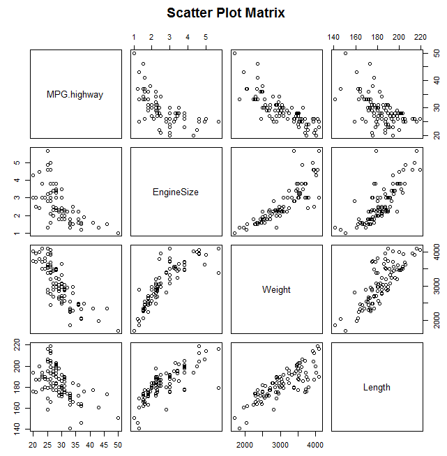
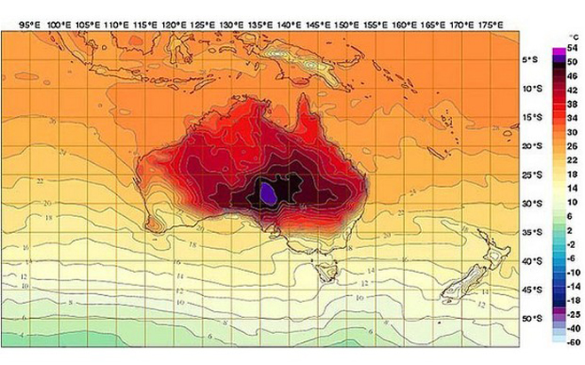
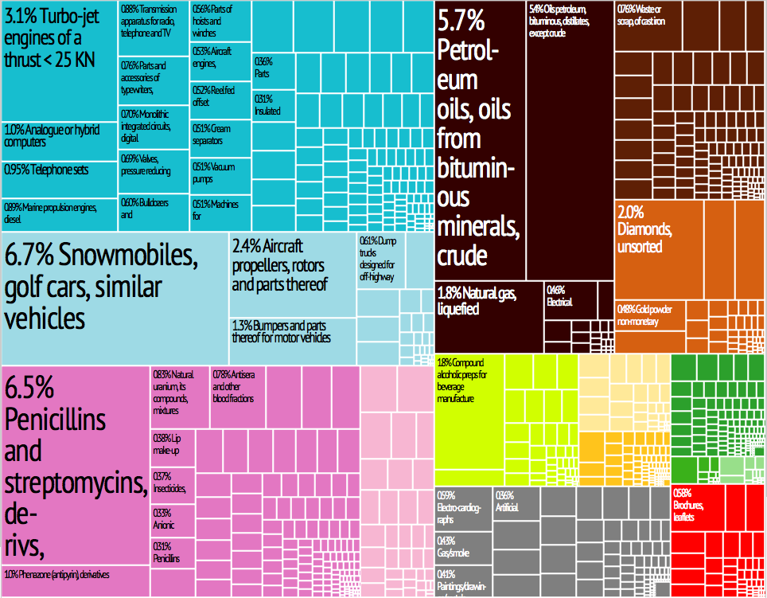
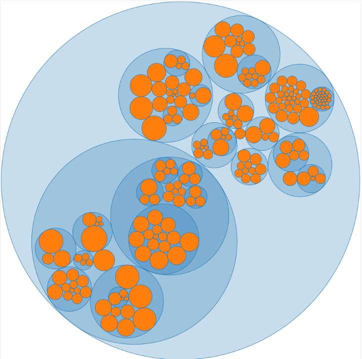
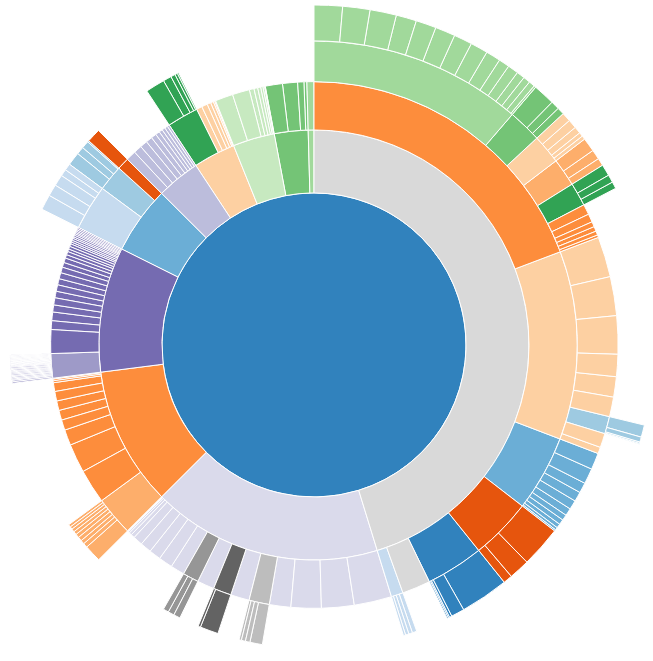
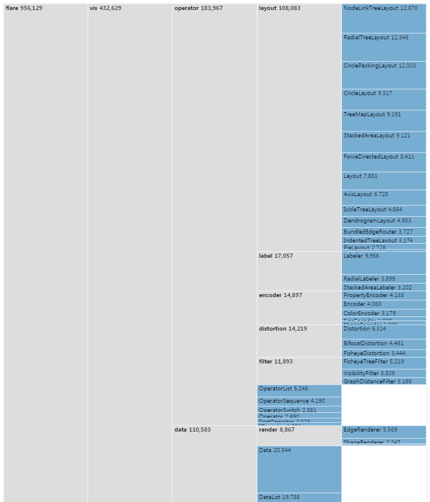
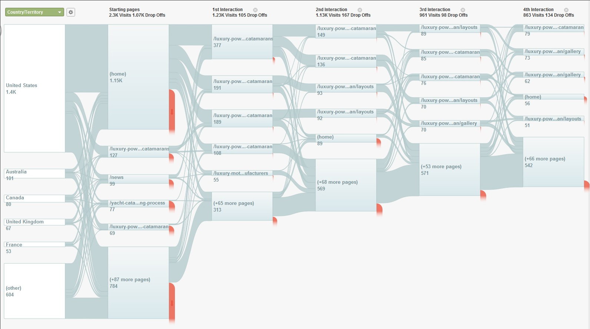

class: middle, center

<p>
<span class="title">
<strong>D3를 활용한 데이터 시각화 방법</strong>
</span>
</p>

---

## 목차

### 1. 데이터 시각화란
### 2. 데이터 시각화의 종류
### 3. 차트(그래프)의 종류
### 4. 시각화에서 자주하는 실수들
### 5. D3 기본
### 6. 재사용 가능한 차트 구현 방법

---

class: middle, center


## 1. 데이터 시각화란

---
class: middle, center


<p class="highlight">
❝<br>
데이터 시각화(Data Visualization)는<br> 
분석된 데이터의 결과를 쉽게 이해할 수 있도록<br> 
시각적으로 표현하고 전달되는 과정을 말한다.<br>
❞<br>
<span style="display:block;text-align:right;margin-right:80px;font:0.8em normal;">
- wikipedia
</span>
</p>

---

class: middle, center


<p class="highlight">
❝<br>
데이터 시각화(Data Visualization)는<br> 
분석된 데이터의 결과를 쉽게 이해할 수 있도록<br> 
시각적으로 표현하고 전달되는 과정을 말한다.<br>
❞<br>
<span style="display:block;text-align:right;margin-right:80px;font:0.8em normal;">
- wikipedia
</span>
</p>


<div style="width:746px;position:absolute;">
<p style="color: #f10000;opacity:0.8;font-size: 1.4em;">
    <strong>정보를 시각적 요소로 변환하는 작업</strong>
</p>
<p style="text-align:left">
가공되지 않은 데이터를 사람이 이해하기 쉬운 시각적 형태로 변환하고 
이를 활용해서 비즈니스를 성공적으로 수행하는데 도움을 줄 수 있다.
</p>


</div>


---

### 데이터 시각화가 시작된 시기

<p style="margin-top:120px;">
<span style="display:inline-block;background:#eee;padding:10px 10px 5px 10px;">

</span>

<span style="display:block;text-align:right;margin-right:0px;font:0.6em normal;">
- 구글 N그램 뷰어
</span>
</p>


.footnote[.red.bold[*] 구글이 수만권의 책의 텍스트를 데이터화 시켜놓음으로써 인류가 어떤 문장과 단어들을 주로 사용 했는지 살펴 볼수 있는 검색 기술]

---

### 데이터 시각화가 중요한 이유


<p class="highlight" style="text-align:center;margin-top:120px;">
❝<br>
인간의 가장 강력한 감각 기관인 눈은<br> 
냄새, 소리, 맛, 촉감을 위한 기관보다<br/> 
대역폭과 처리 능력이 훨씬 더 크다.<br>
<br>
그러므로 정보시각화를 통한 데이터 표현은<br>
인간의 가장 강력한 지각 능력을<br/> 
최대한 효과적으로 활용하는 방법이다.<br/>
❞<br>
<span style="display:block;text-align:right;margin-right:80px;font:0.8em normal;">
- 애덤페러, 아름다운시각화 中
</span>
</p>


---

### 데이터시각화의 7가지 단계


<p class="highlight" style="text-align:center;margin-top:200px;">
데이터시각화의 7가지 단계<br/>
<br/>
<span style="font-size:0.8em">
데이터 획득 - 분석 - 선별 - 데이터마이닝 - 표현 - 개선 - 상호작용
<span><br/><br/>
<span style="display:block;text-align:right;margin-right:80px;font:0.8em normal;">
- 벤 프라이[Ben Fry], Visualizing Data
</span>
</p>


---

### 데이터시각화의 7가지 단계


<p class="highlight" style="text-align:center;margin-top:200px;">
데이터시각화의 7가지 단계<br/>
<br/>
<span style="font-size:0.8em">
데이터 획득 - 분석 - 선별 - 데이터마이닝 - <span class="red">표현</span> - <span class="red">개선</span> - <span class="red">상호작용</span>
<span><br/><br/>
<span style="display:block;text-align:right;margin-right:80px;font:0.8em normal;">
- 벤 프라이[Ben Fry], Visualizing Data
</span>
</p>


---

class: middle, center

## 2. 데이터 시각화의 종류

---

### 인포그래픽(계속)

<p >
- 어떤 주제에 대해서 하나 또는 그 이상의 특정한 측면을 
설명하고 의사소통하는 데 초점을 둔 데이터 시각화의 한 형태
</p>

<p style="text-align:center;">
<span style="display:inline-block;background:#eee;padding:10px 10px 10px 10px;width:607px;text-align:center;">

</span>
</p>

<span style="margin-left:70px">
.footnote[http://blog.kolon.com/225]
</span>
---

### 인포그래픽

<p>
- 1995년 제이미 세라의 참고래에 대한 인포그래픽
</p>

<p style="text-align:center">
<span style="display:inline-block;background:#eee;padding:10px 10px 10px 10px;width:737px;text-align:center;">

</span>
</p>

.footnote[http://3.bp.blogspot.com/_LCqDL30ndZQ/TBPkvZIQaNI/AAAAAAAAAik/OrjA6TShNsk/s1600/INFO-BALLENA.jpg]

---

### 탐색 도구
<p>
- 데이터 셋을 직접 탐색해 보고 의미를 파악할 수 있는 상호작용 가능한 도구를 제공 
</p>

<p style="text-align:center">
<span style="display:inline-block;background:#eee;padding:10px 10px 10px 10px;width:607px;text-align:center;">

</span>
</p>

<span style="margin-left:70px">
.footnote[http://www.gapminder.org/world/]
</span>


---

### 대시보드

<p>
- 어떤 이슈에 대한 핵심 측정치(metrics)를 가능한 빠르고 
효과적으로 이해 할 수 있도록 도와주는 집약적인 차트
</p>

<p style="text-align:center">
<span style="display:inline-block;background:#eee;padding:10px 10px 10px 10px;width:737px;text-align:center;">

</span>
</p>


---


class: middle, center

## 3. 차트(그래프)의 종류

---

### 시각화에 영향을 주는 데이터 형식

<table>
<thead>
<tr>
    <th>데이터 형식</th>
    <th>설명</th>
</tr>
</thead>
<tbody>
    <tr>
        <td>
        배열<br>
        (레코드 등 표 형식으로 표현)
        </td>
        <td>
        각 데이터는 복수의 속성값이 있으며 하나의 데이터는 한 줄로 표현</td>
    </tr>
    <tr>
        <td>
        그래프<br>
        (트리 구조와 중첩 구조, 네트워크 등)</td>
        <td>
        노드(정점)와 노드를 잇는 에지(변)로 구성된다.<br>
        에지에는 방향이 있는 것과 방향이 없는 것이 있다.<br>
        노드 간의 관계는 인접행렬 등으로 표현되는 일이 많다.<br>
         에지에는 그 관계성이 붙어 있는 것도 있다.
        </td>
    </tr>
</tbody>
</table>

---

### 배열 데이터를 표현하는 차트(그래프)

- 막대그래프
- 누적 막대그래프
- 히스토그램
- 퍼널 그래프
- 꺾은선그래프
- 평행형 / 방사형 차트
- 영역형 그래프
- 원그래프 / 도넛그래프
- 상자 수염 그림
- 산포도
- 산포도 행렬
- 버블차트
- 히트맵

---

### 막대그래프
<p>
- 같은 너비의 막대를 사용하여 높이로 데이터를 표현<br>
- 데이터의 크기 비교에 적합<br>
- 그리는 방식에 따라 막대를 세로 또는 가로로 그리는 경우가 있음<br>
- 복수 계열을 표현할 경우 10개 이상 늘어나지 않도록 할 것<br>
</p>

<div id="bar-content"></div>

---

### 누적 막대그래프

---

### 히스토그램

---

### 퍼널 그래프

---

### 꺾은선그래프

---

### 평행형 / 방사형 차트

---

### 영역형 그래프

---

### 원그래프 /도넛그래프

---

### 상자 수염 그림

---

### 산포도
<p>
- X축과 Y축으로 두 데이터 사이의 관계성을 표현<br>
- 상관관계 유무 등을 볼 수 있으므로 데이터의 기본적인 성질을 파악하는데 이용<br>
</p>

---

### 산포도 행렬

<p>
- 산포도 자체를 매트릭스 형태로 배치하여 여러 변수의 관계성을 시각화<br>
- 각각의 행과 열은 모두 다른 변수를 나타내며 교차하는 부분이 각 변수의 산포도로 표현<br>
</p>

<p style="text-align:center">
<span style="display:inline-block;background:#eee;padding:10px 10px 10px 10px;width:400px;text-align:center;">

</span>
</p>


---

### 버블차트

<p>
- 점을 원으로 그려 반지름으로 수치를 표현<br>
- X축, Y축, 반지름으로 세 가지 수치 데이터 표현<br>
</p>

<div id="bubble-chart"></div>

---

### 히트맵

<p>
- 분포의 도수를 색으로 표현해서 위치 정보에 플롯한 시각화<br>
- 어느 위치에서 도수가 높거나 낮은지를 한눈에 파악 가능<br>
</p>

<p style="text-align:center">
<span style="display:inline-block;background:#eee;padding:10px 10px 10px 10px;width:637px;text-align:center;">

</span>
</p>

<span style="margin-left:60px">
.footnote[http://wired.jp/2013/01/09/australia-temperature-map/]
</span>

---

### 그래프 데이터를 표현하는 차트(그래프)

- 트리맵
- 파티션 다이어그램
- 산키 차트
- 역학 그래프

---

### 트리맵(Treemap)

<p>
- 중첩 구조(트리 구조)로 된 계층적 데이터를 면접으로 표시한 차트<br>
- 각각의 데이터가 전체에서 차지하는 비율을 구조적으로 확인 가능<br>
</p>

<p style="text-align:center">
<span style="display:inline-block;background:#eee;padding:10px 10px 10px 10px;width:537px;text-align:center;">
    
</span>
</p>

<span style="margin-left:100px">
.footnote[http://hyukjunseo.egloos.com/m/3508960]
</span>

---

### 파티션 다이어그램(Partition Diagram)

<p>
- 큰 카테고리에서부터 작은 항목으로 계층적 관계성과 양적 관계를 표시<br>
- 관계성 파악을 위해서는 원 또는 방사형으로 양적인 관계 파악은 사각형 형태 선택<br>
<p>


<p style="text-align:center">
<span style="display:inline-block;background:#eee;padding:10px 10px 10px 10px;width:740px;text-align:center;">
    <span style="width:33%;float:left;">
    
    </span>
    <span style="width:33%;float:left;">
    
    </span>
    <span style="width:34%;float:left;">
    
    </span>
</span>
</p>

<span style="margin-left:0px">
.footnote[http://bl.ocks.org/mbostock]
</span>

---

### 산키 차트(Sankey Chart)

<p>
- 어디에서부터 어디로 향하는지에 대해 시각화<br>
- 사용자의 흐름이나 이동을 표현<br>
- 반복이 발생하거나 이동 패턴이 많이 존재하면 구조가 복잡해지는 단점<br>
</p>

<p style="text-align:center">
<span style="display:inline-block;background:#eee;padding:10px 10px 10px 10px;width:637px;text-align:center;">
    
</span>
</p>

<span style="margin-left:45px">
.footnote[https://esotech.com/blog/]
</span>


---

### 역학 그래프(Force Directed Graph)

<div width="100%">
<canvas id="force-chart" width="800" height="500"></canvas>
</div>


---

<p style="text-align:center">
<span style="display:inline-block;background:#eee;padding:10px 10px 10px 10px;width:737px;text-align:center;">
    
</span>
</p>

---

class: middle, center

<h2>
4. 시각화에서 자주하는 실수들<br/>
<span style="font-size:0.8em">(피해야 할 그래프)</span>
</h2>
---

## 목표
<p>
- 흔히하는 실수의 사례를 이해함으로써 잘못된 시각화를 피하고 적절한 시각화를 선택할 수 있도록 한다.
</p>


<p style="text-align:left;margin-top:0px;">
    
</p> 

---
### 원그래프


---

### 3D 그래프

<p>
- 모두 같은 값이지만 뒤에 있는 오브젝트는 가려지므로 앞쪽에 있는 오브젝트의 표면적이 다른 오브젝트보다 커진다.
<br/>
<br/>
- 보는 시점에 따라 더 큰 왜곡으로 보여진다.
</p>


<p style="text-align:center">
<span style="display:inline-block;background:#eee;padding:10px 10px 10px 10px;width:737px;text-align:center;">
    <span style="width:50%;float:left;">
    
    </span>
    <span style="width:50%;float:left;">
    
    </span>
    
</span>
</p>


---
### 그림 그래프
<p>
- 그림의 크기로 데이터의 크기를 나타내는 그래프
<br/>
<br/>
- 오른쪽과 왼쪽과 데이터 대비 두 배지만 2배 이상인 느낌을 준다.
</p>


<p style="text-align:center">
<span style="display:inline-block;background:#eee;padding:10px 10px 10px 10px;width:517px;text-align:center;">

</span>
</p>


---

class: middle, center

## 5. D3 기본

---

### D3.js란?


---


---
### SVG 좌표 시스템

<div style="background-color:#eee;height:320px;">
<svg width="100%" height="500">
    <circle cx="0" cy="0" r="10" />
    <line x1="0" y1="0" x2="0" y2="500" stroke-width="1.5" stroke="#000"/>
    <line x1="0" y1="0" x2="1000" y2="0" stroke-width="1.5" stroke="#000"/>
</svg>
</div>

---

### SVG 문서요소 - 사각형

```xml
<rect x="0" y="0" width="600" height="80"/>
```
<div style="background-color:#eee;height:300px;">
<svg width="748">
   <g width="700" transform="translate(25,60)">
   <rect x="0" y="0" width="700" height="80"/>
   </g>
</svg>
</div>

---

### SVG 문서요소 - 사각형

```xml
<rect x="0" y="0" width="600" height="80" 
                     fill="red" stroke="black" stroke-width="5px"/>
```
<div style="background-color:#eee;height:300px;">
<svg width="748">
   <g width="700" transform="translate(25,60)">
   <rect x="0" y="0" width="700" height="80" fill="red" stroke="black" stroke-width="5px"/>
   </g>
</svg>
</div>
---

### SVG 문서요소 - 원

```xml
<circle cx="100" cy="100" r="100" 
                      fill="blue" stroke="black" stroke-width="5px"/>
```
<div style="background-color:#eee;height:320px;">
<svg width="748" height="500">
   <g transform="translate(250,50)">
   <circle cx="100" cy="100" r="100" fill="blue" stroke="black" stroke-width="5px"/>
   </g>
</svg>
</div>
---

### SVG 문서요소 - 타원

```xml
<ellipse cx="100" cy="100" rx="200" ry="50" 
                      fill="blue" stroke="black" stroke-width="5px"/>
```
<div style="background-color:#eee;height:320px;">
<svg width="748" height="500">
   <g transform="translate(250,50)">
   <ellipse cx="100" cy="100" rx="200" ry="50" 
                      fill="green" stroke="black" stroke-width="5px"/>
   </g>
</svg>
</div>

---

### SVG 문서요소 - 선

```xml
<ellipse cx="100" cy="100" rx="200" ry="50" 
                      fill="blue" stroke="black" stroke-width="5px"/>
```
<div style="background-color:#eee;height:320px;">
<svg width="748" height="500">
   <g transform="translate(100,50)">
   <line x1="0" y1="0" x2="500" y2="200" 
                      stroke="purple" stroke-width="5px"/>
   </g>
</svg> 
</div>
 


---

### 척도(Scale)

<p>
- 입력되는 정의역(domain)과 출력되는 치역(range)을 매핑한 함수
<br>
<br>
- 데이터 값을 시각화에 필요한 적절한 값(비율)로 매핑
</p>

<div style="background-color:#eee;height:320px;">
<svg width="748" height="500">
   <g transform="translate(100,100)">
   <line x1="0" y1="0" x2="500" y2="0" stroke="black" />
   <line x1="50" y1="100" x2="450" y2="100" stroke="black" />
   <circle cx="0" cy="0" r="5"/>
   <circle cx="250" cy="0" r="5"/>
   <circle cx="500" cy="0" r="5"/>
   <text x="0" y="20" font-size="15">100</text>
   <text x="235" y="20" font-size="15">300</text>
   <text x="490" y="20" font-size="15">500</text>
   
   <circle cx="50" cy="100" r="5"/>
   <circle cx="250" cy="100" r="5"/>
   <circle cx="450" cy="100" r="5"/>
   <text x="40" y="120" font-size="15">10</text>
   <text x="235" y="120" font-size="15">180</text>
   <text x="440" y="120" font-size="15">350</text>
   </g>
</svg> 
</div>

---
### D3에서 제공하는 척도의 종류
- d3.scale.linear()<br>
<span style="font-size:20px">선형 척도</span>
- d3.scale.ordinal()<br>
<span style="font-size:20px">- 치역이 카테고리 이름 같이 측정 불가능한 값일 경우에 사용하는 척도</span> 
- d3.scale.sqrt()<br>
<span style="font-size:20px">- 제곱근 척도</span>
- d3.scale.pow()<br>
<span style="font-size:20px">- 제곱 척도</span>
- d3.scale.log()<br>
<span style="font-size:20px">- 상용 로그(log) 척도</span>
- d3.scale.quntize()<br>
<span style="font-size:20px">- 치역을 위해 이산 값을 제공하는 선형 척도</span>
- d3.scale.quantile()<br>
<span style="font-size:20px">- 양자 척도와 비슷하지만, 정의역이 이산 값을 가짐</span>
- d3.time.scale()<br>
<span style="font-size:20px">날짜와 시간을 위한 척도</span>

 
---

### D3에서 제공하는 척도의 종류
- d3.scale.category10()<br>
- d3.scale.category20()<br>
- d3.scale.category20b()<br>
- d3.scale.category20c()<br>
<span style="font-size:20px">미리 정의된 10개 또는 20개의 색상 서열 척도</span>

---


### 척도 생성 방법

```javascript
var scale = d3.scale.linear()
                        .domain([100,500])  // 정의역
                        .range([10,350]);   // 치역
                        
console.log(scale(100));    // 10
console.log(scale(500));    // 350                        
console.log(scale(300));    // 180
console.log(scale(800));    // ??
```

---

### 척도 생성 방법

```javascript
var scale = d3.scale.linear()
                        .domain([100,500])  // 정의역
                        .range([10,350]);   // 치역
                        
console.log(scale(100));    // 10
console.log(scale(500));    // 350                        
console.log(scale(300));    // 180
console.log(scale(800));    // 605
```

--

```javascript
var scale = d3.scale.linear()
                        .domain([100,500])
                        .range([10,350])
*                       .clamp(true);

console.log(scale(800));    // 350
console.log(scale(-100));    // 10
```
- nice()
- rangeRound()
- clamp()

---

### 축(Axis)

<p>
- 척도와 형태가 유사
<br>
<br>
- 어떤 값을 반환하는 대신에 선과 라벨, 구분자를 가진 시각적 요소가 생성
</p>

---

### 축 생성 방법

```javascript
var xAxis = d3.svg.axis()
                   .scale(xScale)   // 척도 설정
                   .orient("bottom");   // 축을 나타내는 선을 기준으로 라벨의 위치 지정

svg.append("g")
        .call(xAxis);
```

- g 문서요소의 역할<br>
<span style="font-size:19px">- 다른 문서요소의 컨테이너 역할</span><br>
<span style="font-size:19px">- 시각적 요소들을 렌더링하는 방법을 결정하는 트랜스폼(transformation) 적용</span>
- call() 함수<br>
<span style="font-size:19px">- 메서드 체인 앞단의 선택물을 가져와서 함수로 전달</span>
```javascript
xAxis(svg.append("g"))
```

---

```css
.axis path,
.axis line {
    fill: none;
    stroke: black;
    shape-rendering: crispEdges;
}

.axis text {
    font-family: sans-serif;
    font-size: 11px;
}
```

---
- 브라우저에서 지원하는 표준 이벤트만 인식
<span style="font-size:13px;">(<a href="http://quirksmode.org/dom/events/">http://quirksmode.org/dom/events/</a>)</span>
- 특정 문서 요소와 이벤트 바인딩

### ㄹㄴㅇㄹ

---

### 상호작용

<p>
</p>

```javascript
d3.select("p")
    .on("click", function() {
        // 클릭 시 수행될 작업
    });
```

