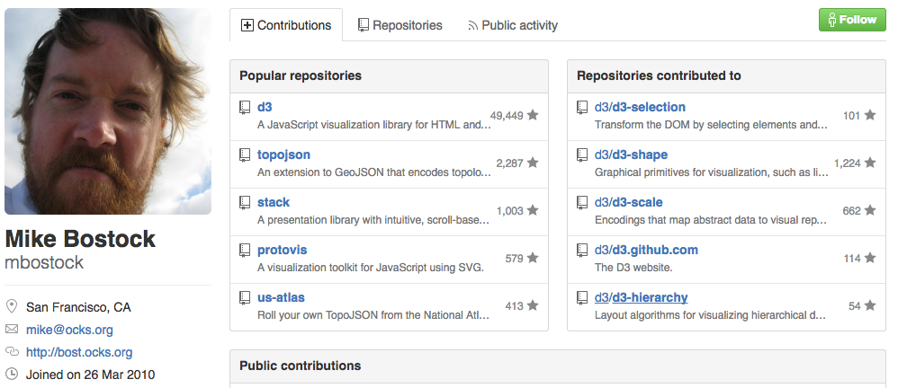

class: middle, center

<p>
<span class="title">
<strong>D3를 활용한 데이터 시각화 방법</strong>
</span>
</p>

---

## 목차

### 1. 데이터 시각화란
### 2. 데이터 시각화의 종류
### 3. 차트(그래프)의 종류
### 4. 시각화에서 자주하는 실수들
### 5. D3 기본
### 6. 재사용 가능한 차트 구현 방법

---

class: middle, center


## 1. 데이터 시각화란

---
class: middle, center


<p class="highlight">
❝<br>
데이터 시각화(Data Visualization)는<br> 
분석된 데이터의 결과를 쉽게 이해할 수 있도록<br> 
시각적으로 표현하고 전달되는 과정을 말한다.<br>
❞<br>
<span style="display:block;text-align:right;margin-right:80px;font:0.8em normal;">
- wikipedia
</span>
</p>

---

class: middle, center


<p class="highlight">
❝<br>
데이터 시각화(Data Visualization)는<br> 
분석된 데이터의 결과를 쉽게 이해할 수 있도록<br> 
시각적으로 표현하고 전달되는 과정을 말한다.<br>
❞<br>
<span style="display:block;text-align:right;margin-right:80px;font:0.8em normal;">
- wikipedia
</span>
</p>


<div style="width:746px;position:absolute;">
<p style="color: #f10000;opacity:0.8;font-size: 1.4em;">
    <strong>정보를 시각적 요소로 변환하는 작업</strong>
</p>
<p style="text-align:left">
가공되지 않은 데이터를 사람이 이해하기 쉬운 시각적 형태로 변환하고 
이를 활용해서 비즈니스를 성공적으로 수행하는데 도움을 줄 수 있다.
</p>


</div>


---

### 데이터 시각화가 시작된 시기

<p style="margin-top:120px;">
<span style="display:inline-block;background:#eee;padding:10px 10px 5px 10px;">

</span>

<span style="display:block;text-align:right;margin-right:0px;font:0.6em normal;">
- 구글 N그램 뷰어
</span>
</p>


.footnote[.red.bold[*] 구글이 수만권의 책의 텍스트를 데이터화 시켜놓음으로써 인류가 어떤 문장과 단어들을 주로 사용 했는지 살펴 볼수 있는 검색 기술]

---

### 데이터 시각화가 중요한 이유


<p class="highlight" style="text-align:center;margin-top:120px;">
❝<br>
인간의 가장 강력한 감각 기관인 눈은<br> 
냄새, 소리, 맛, 촉감을 위한 기관보다<br/> 
대역폭과 처리 능력이 훨씬 더 크다.<br>
<br>
그러므로 정보시각화를 통한 데이터 표현은<br>
인간의 가장 강력한 지각 능력을<br/> 
최대한 효과적으로 활용하는 방법이다.<br/>
❞<br>
<span style="display:block;text-align:right;margin-right:80px;font:0.8em normal;">
- 애덤페러, 아름다운시각화 中
</span>
</p>


---

### 데이터 시각화의 7가지 단계


<p class="highlight" style="text-align:center;margin-top:200px;">
데이터 시각화의 7가지 단계<br/>
<br/>
<span style="font-size:0.8em">
데이터 획득 - 분석 - 선별 - 데이터마이닝 - 표현 - 개선 - 상호작용
<span><br/><br/>
<span style="display:block;text-align:right;margin-right:80px;font:0.8em normal;">
- 벤 프라이[Ben Fry], Visualizing Data
</span>
</p>


---

### 데이터 시각화의 7가지 단계


<p class="highlight" style="text-align:center;margin-top:200px;">
데이터 시각화의 7가지 단계<br/>
<br/>
<span style="font-size:0.8em">
데이터 획득 - 분석 - 선별 - 데이터마이닝 - <span class="red">표현</span> - <span class="red">개선</span> - <span class="red">상호작용</span>
<span><br/><br/>
<span style="display:block;text-align:right;margin-right:80px;font:0.8em normal;">
- 벤 프라이[Ben Fry], Visualizing Data
</span>
</p>


---

class: middle, center

## 2. 데이터 시각화의 종류

---

### 인포그래픽(계속)

<p >
- 어떤 주제에 대해서 하나 또는 그 이상의 특정한 측면을 
설명하고 의사소통하는 데 초점을 둔 데이터 시각화의 한 형태
</p>

<p style="text-align:center;">
<span style="display:inline-block;background:#eee;padding:10px 10px 10px 10px;width:607px;text-align:center;">

</span>
</p>

<span style="margin-left:70px">
.footnote[http://blog.kolon.com/225]
</span>
---

### 인포그래픽

<p>
- 1995년 제이미 세라의 참고래에 대한 인포그래픽
</p>

<p style="text-align:center">
<span style="display:inline-block;background:#eee;padding:10px 10px 10px 10px;width:737px;text-align:center;">

</span>
</p>

.footnote[http://3.bp.blogspot.com/_LCqDL30ndZQ/TBPkvZIQaNI/AAAAAAAAAik/OrjA6TShNsk/s1600/INFO-BALLENA.jpg]

---

### 탐색 도구
<p>
- 데이터 셋을 직접 탐색해 보고 의미를 파악할 수 있는 상호작용 가능한 도구를 제공<br>
- <a href"http://www.ted.com/talks/hans_rosling_shows_the_best_stats_you_ve_ever_seen/transcript?language=en">
한스 로스링(Hans Rosling)의 시각화(TED 영상)</a>
</p>

<p style="text-align:center">
<span style="display:inline-block;background:#eee;padding:10px 10px 10px 10px;width:607px;text-align:center;">

</span>
</p>

<span style="margin-left:70px">
.footnote[http://www.gapminder.org/world/]
</span>


---

### 대시보드

<p>
- 어떤 이슈에 대한 핵심 측정치(metrics)를 가능한 빠르고 
효과적으로 이해 할 수 있도록 도와주는 집약적인 차트
</p>

<p style="text-align:center">
<span style="display:inline-block;background:#eee;padding:10px 10px 10px 10px;width:737px;text-align:center;">

</span>
</p>


---


class: middle, center

## 3. 차트(그래프)의 종류

---

### 시각화에 영향을 주는 데이터 형식

<table>
<thead>
<tr>
    <th>데이터 형식</th>
    <th>설명</th>
</tr>
</thead>
<tbody>
    <tr>
        <td>
        배열<br>
        (레코드 등 표 형식으로 표현)
        </td>
        <td>
        각 데이터는 복수의 속성값이 있으며 하나의 데이터는 한 줄로 표현</td>
    </tr>
    <tr>
        <td>
        그래프<br>
        (트리 구조와 중첩 구조, 네트워크 등)</td>
        <td>
        노드(정점)와 노드를 잇는 에지(변)로 구성된다.<br>
        에지에는 방향이 있는 것과 방향이 없는 것이 있다.<br>
        노드 간의 관계는 인접행렬 등으로 표현되는 일이 많다.<br>
         에지에는 그 관계성이 붙어 있는 것도 있다.
        </td>
    </tr>
</tbody>
</table>

---

### 배열 데이터를 표현하는 차트(그래프)

<div>
    <div style="float:left;width:50%;">
    - 막대그래프
    <br>
    <br>
    - 누적 막대그래프
    <br>
    <br>
    - 히스토그램
    <br>
    <br>
    - 퍼널 그래프
    <br>
    <br>
    - 꺾은선그래프
    <br>
    <br>
    - 평행형 / 방사형 차트
    <br>
    <br>
    - 영역형 그래프
    </div>
    <div style="float:left;width:50%">
    - 원그래프 / 도넛그래프
    <br>
    <br>
    - 상자 수염 그림
    <br>
    <br>
    - 산포도
    <br>
    <br>
    - 산포도 행렬
    <br>
    <br>
    - 버블차트
    <br>
    <br>
    - 히트맵    
    </div>
</div>


---

### 막대그래프
<p>
- 같은 너비의 막대를 사용하여 높이로 데이터를 표현
<br>
<br>
- 데이터의 크기 비교에 적합
<br>
<br>
- 그리는 방식에 따라 막대를 세로 또는 가로로 그리는 경우가 있음
<br>
<br>
- 복수 계열을 표현할 경우 10개 이상 늘어나지 않도록 할 것
</p>

<div id="bar-content"></div>

---

### 누적 막대그래프

---

### 히스토그램

---

### 퍼널 그래프

---

### 꺾은선그래프

---

### 평행형 / 방사형 차트

---

### 영역형 그래프

---

### 원그래프 /도넛그래프

---

### 상자 수염 그림

---

### 산포도
<p>
- X축과 Y축으로 두 데이터 사이의 관계성을 표현<br>
- 상관관계 유무 등을 볼 수 있으므로 데이터의 기본적인 성질을 파악하는데 이용<br>
</p>

---

### 산포도 행렬

<p>
- 산포도 자체를 매트릭스 형태로 배치하여 여러 변수의 관계성을 시각화<br>
- 각각의 행과 열은 모두 다른 변수를 나타내며 교차하는 부분이 각 변수의 산포도로 표현<br>
</p>

<p style="text-align:center">
<span style="display:inline-block;background:#eee;padding:10px 10px 10px 10px;width:400px;text-align:center;">

</span>
</p>


---

### 버블차트

<p>
- 점을 원으로 그려 반지름으로 수치를 표현<br>
- X축, Y축, 반지름으로 세 가지 수치 데이터 표현<br>
</p>

<div id="bubble-chart"></div>

---

### 히트맵

<p>
- 분포의 도수를 색으로 표현해서 위치 정보에 플롯한 시각화
<br>
<br>
- 어느 위치에서 도수가 높거나 낮은지를 한눈에 파악 가능
</p>

<p style="text-align:center">
<span style="display:inline-block;background:#eee;padding:10px 10px 10px 10px;width:637px;text-align:center;">

</span>
</p>

<span style="margin-left:60px">
.footnote[http://wired.jp/2013/01/09/australia-temperature-map/]
</span>

---

### 그래프 데이터를 표현하는 차트(그래프)

- 트리맵
<br>
<br>
- 파티션 다이어그램
<br>
<br>
- 산키 차트
<br>
<br>
- 역학 그래프

---

### 트리맵(Treemap)

<p>
- 중첩 구조(트리 구조)로 된 계층적 데이터를 면적으로 표시한 차트
<br>
<br>
- 각각의 데이터가 전체에서 차지하는 비율을 구조적으로 확인 가능<br>
</p>

<p style="text-align:center">
<span style="display:inline-block;background:#eee;padding:10px 10px 10px 10px;width:537px;text-align:center;">
    
</span>
</p>

<span style="margin-left:100px">
.footnote[http://hyukjunseo.egloos.com/m/3508960]
</span>

---

### 파티션 다이어그램(Partition Diagram)

<p>
- 큰 카테고리에서부터 작은 항목으로 계층적 관계성과 양적 관계를 표시
<br>
<br>
- 관계성 파악은 원 또는 방사형 선택
<br>
<br>
- 양적인 관계 파악은 사각형 형태 선택
<p>


<p style="text-align:center">
<span style="display:inline-block;background:#eee;padding:10px 10px 10px 10px;width:740px;text-align:center;">
    <span style="width:33%;float:left;">
    
    </span>
    <span style="width:33%;float:left;">
    
    </span>
    <span style="width:34%;float:left;">
    
    </span>
</span>
</p>

<span style="margin-left:0px">
.footnote[http://bl.ocks.org/mbostock]
</span>

---

### 산키 차트(Sankey Chart)

<p>
- 어디에서부터 어디로 향하는지에 대해 시각화
<br>
<br>
- 사용자의 흐름이나 이동을 표현
<br>
<br>
- 반복이 발생하거나 이동 패턴이 많이 존재하면 구조가 복잡해지는 단점
</p>

<p style="text-align:center">
<span style="display:inline-block;background:#eee;padding:10px 10px 10px 10px;width:637px;text-align:center;">
    
</span>
</p>

<span style="margin-left:45px">
.footnote[https://esotech.com/blog/]
</span>

???
Google Analyics의 유저 플로우<br>
사용자가 어떻게 이동하며, 어디에서 크게 이탈하는지를 파악 할 수 있다.


---

### 역학 그래프(Force Directed Graph)

<p>
- 노드와 그 관계를 표현하는데 적합
<br>
<br>
- 인맥 등이 나타나는 소셜 그래프나 사용자가 대상에 하는 행위 등을 시각화할 때 사용
</p>
<div width="100%">
<canvas id="force-chart" width="800" height="500"></canvas>
</div>


---

<p style="text-align:center">
<span style="display:inline-block;background:#eee;padding:10px 10px 10px 10px;width:737px;text-align:center;">
    
</span>
</p>

???
시각화 형태가 너무 많아서 어느 시각화를 이용하면 좋을지 고민된다<br>
다음 표는 데이터 성질에 따른 적절한 시각화를 선택할 수 있는 가이드를 제공한다

---

class: middle, center

<h2>
4. 시각화에서 자주하는 실수<br/>
<span style="font-size:0.8em">(피해야 할 그래프)</span>
</h2>
---

## 목표
<p>
- 잘못된 시각화를 피하고 적절한 시각화를 선택하도록 한다.
</p>


<p style="text-align:left;margin-top:0px;">
    
</p> 

---
### 원그래프

<p>
- 각 요소의 크기를 정확하게 인지하기 어렵다.
<br>
<br>
- 복수의 원그래프를 비교하기 어렵다.
<br>
<br>
- 위 두 문제를 해결한 띠그래프와 막대그래프를 사용하라.
</p>

???
사람의 눈은 길이보다 면적을 이해하기가 어렵고 각도도 정확히 인식하기 어렵기 때문에, 
막대 그래프와 띠그래프가 해석의 편의성 측면에서 더 적절하다


---

### 3D 그래프

<p>
- 앞쪽에 있는 오브젝트의 표면적이 다른 오브젝트보다 커져 보인다.
<br/>
<br/>
- 보는 시점에 따라 더 큰 왜곡되어 보여진다.
</p>


<p style="text-align:center">
<span style="display:inline-block;background:#eee;padding:10px 10px 10px 10px;width:737px;text-align:center;">
    <span style="width:50%;float:left;">
    
    </span>
    <span style="width:50%;float:left;">
    
    </span>
    
</span>
</p>


---
### 그림 그래프
<p>
- 그림의 크기로 데이터의 크기를 나타내는 그래프
<br/>
<br/>
- 오른쪽과 왼쪽과 데이터 대비 두 배지만 2배 이상인 느낌을 준다.
</p>


<p style="text-align:center">
<span style="display:inline-block;background:#eee;padding:10px 10px 10px 10px;width:517px;text-align:center;">

</span>
</p>


---

class: middle, center

## 5. D3 기본

---

### D3 소개

<p>
- 데이터 시각화 제작을 위한 자바스크립트 라이브러리
<br>
<br>
- 웹 문서를 데이터 중심으로 다룰 수 있음(Data Driven Document)
<br>
<br>
- 마이크 보스탁(Mike Bostock, http://bost.ocks.org/mike)
<br>
<br>
- BSD 라이선스
<br/>
<br/>
- http://www.d3js.org<br>
</p>

<p style="text-align:center">
<span style="display:inline-block;background:#eee;padding:10px 10px 10px 10px;width:600px;text-align:center;">

</span>
</p>

???
마이크 보스톡
- 2011년 D3.js 공식 발표
- 2015년 시각화 도구 개발에 매진하기 위해 뉴욕타임즈 떠났다


---

### SVG(Scalable Vector Graphics)

<p>
- 텍스트 기반의 이미지 포맷
<br>
<br>
- HTML과 비슷한 마크업 코드로 정의
<br>
<br>
- IE8 이하를 제외한 모든 브라우저가 지원
<span style="font-size:20px;">(<a href="http://caniuse.com/#feat=svg">http://caniuse.com/#feat=svg</a>)</span>
</p>

<table>
<thead>
<tr style="height:35px">
    <th>Canvas</th>
    <th>SVG</th>
</tr>
</thead>
<tbody >
    <tr style="height:35px">
        <td style="width:49%;text-align:left!important">픽셀 기반</td>
        <td style="width:49%;">벡터 기반</td>
    </tr>
    <tr style="height:35px">
        <td style="text-align:left!important">단일 HTML 요소(Canvas)</td>
        <td>DOM의 일부가 되는 복수의 그래픽 요소</td>
    </tr>
    <tr style="height:35px">
        <td style="text-align:left!important">스크립트로만 스타일 변경</td>
        <td>스크립트와 CSS로 스타일 변경</td>
    </tr>
    <tr style="height:35px">
        <td style="text-align:left!important">다수의 오브젝트(10,000 이상), 작은 표면에서 높은 성능</td>
        <td>소수의 오브젝트(10,000 미만), 큰 표면에서 높은 성능</td>
    </tr>
</tbody>
</table>
<br>
<div>
    <div style="width:49%;float:left;border:1px solid #eee" id="canvas-area">
        
    </div>
    <div style="width:49%;float:left;border:1px solid #eee" id="svg-area">
       
    </div>
</div>


???
div 같은 다른 HTML 문서요소도 그릴 수 있지만 투박하고 브라우저별로 다르게 보일수 있다.
SVG가 더 믿을 만하고 브라우저 일관성이 뛰어나며 심지어 빠르다<br>
벡터 형식의 확장 가능한 그래픽 요소를 이용하므로 확대 및 축소, 회전등의 변형 시 이미지 품질이 떨어지지 않는다.
DOM과 동일한 요소로 취급되기 때문에 디버그 하기 쉽다

---
### SVG 좌표 시스템

<p>
- 일반적인 픽셀 기반의 좌표 시스템과 동일
<br>
<br>
- 드로잉 영역의 좌측 상단을 0, 0으로 지정
</p>


<div style="background-color:#eee;height:320px;">
<svg width="748" height="500">  
    <g transform="translate(10,10)">
    <circle cx="0" cy="0" r="5" />
    <text x="5" y="20">0,0</text>
    <circle cx="200" cy="100" r="5" />
    <text x="205" y="100">200,100</text>
    <circle cx="300" cy="200" r="5" />
    <text x="305" y="200">300,200</text>
    <line x1="0" y1="0" x2="0" y2="300" stroke-width="1.5" stroke="#000" marker-end="url(#triangle-end)"/>
    <line x1="0" y1="0" x2="730" y2="0" stroke-width="1.5" stroke="#000" marker-end="url(#triangle-end)"/>
    
    </g>
    <defs>
        <marker id="triangle-x" viewBox="0 0 10 10" refX="10" refY="5" markerWidth="6" markerHeight="6" orient="auto">
            <path d="M 0 0 L 10 5 L 0 10 z"/>
        </marker>
        <marker id="triangle-end" viewBox="0 0 10 10" refX="10" refY="5" markerWidth="6" markerHeight="6" orient="auto">
            <path d="M 0 0 L 10 5 L 0 10 z"/>
        </marker>
    </defs>
    
    
</svg>
</div>

???
일반적인 픽셀 기반의 좌표 시스템과 동일하게 드로잉 영역의 좌측 상단을 0.0으로 한다.

---

### SVG 문서요소 - 사각형

```xml
<rect x="0" y="0" width="600" height="80" />
```
<div style="background-color:#eee;height:200px;">
<svg width="748">
   <g width="700" transform="translate(25,60)">
   <rect x="0" y="0" width="700" height="80"/>
   </g>
</svg>
</div>


```xml
<rect x="0" y="0" width="600" height="80" rx="20" ry="20"  
                     fill="red" stroke="black" stroke-width="5" />
```
<div style="background-color:#eee;height:200px;">
<svg width="748">
   <g width="700" transform="translate(25,60)">
   <rect x="0" y="0" width="700" height="80" rx="20" ry="20" 
                    fill="red" stroke="black" stroke-width="5"  />
   </g>
</svg>
</div>

???
SVG 시각 요소의 기본 스타일은 외곽선이 없고 바탕이 검은색이다.<br>
다른 스타일을 원하면 문서요소에 스타일을 지정해야한다


---

### SVG 문서요소 - 원

```xml
<circle cx="100" cy="100" r="100" 
                      fill="#0000ff" stroke="black" stroke-width="5" />
```
<div style="background-color:#eee;height:320px;">
<svg width="748" height="500">
   <g transform="translate(250,50)">
   <circle cx="100" cy="100" r="100" fill="#0000ff" stroke="black" stroke-width="5" />
   </g>
</svg>
</div>
---

### SVG 문서요소 - 타원

```xml
<ellipse cx="100" cy="100" rx="200" ry="50" 
                      fill="rgba(0, 255, 0, 0.5)" stroke="black" stroke-width="5" />
```
<div style="background-color:#eee;height:320px;">
<svg width="748" height="500">
   <g transform="translate(250,50)">
   <ellipse cx="100" cy="100" rx="200" ry="50" 
                      fill="rgba(0, 255, 0, 0.5)" stroke="black" stroke-width="5" />
   </g>
</svg>
</div>

???
반지름 r 대신에 축별로 두개의 반지름 값 rx와 ry

---

### SVG 문서요소 - 선

```xml
<line x1="0" y1="0" x2="500" y2="200" 
                      stroke="purple" stroke-width="5" />
```
<div style="background-color:#eee;height:320px;">
<svg width="748" height="500">
   <g transform="translate(100,50)">
   <line x1="0" y1="0" x2="500" y2="200" 
                      stroke="purple" stroke-width="5" />
   </g>
</svg> 
</div>

---

### SVG 문서요소 - 컨테이너 요소

<div>
    <div style="float:left;width:50%;">
        <ul>
        <li style="font-weight:bold;">g</li>
        <br>
        <li style="font-weight:bold;">a</li>
        <br>
        <li>defs</li>
        <br>
        <li>glyph</li>
        <br>
        <li>marker</li>
        <br>
        <li>mask</li>
        <br>
        <li>missing-glyph</li>
        </ul>
    </div>
    <div style="float:left;width:50%">
        <ul>
        <li>pattern</li>
        <br>
        <li>switch</li>
        <br>
        <li>symbol</li>
        </ul>
    </div>
</div>
 


---

### D3 다운로드 및 참조하기

<p>
- https://github.com/mbostock/d3 다운로드
<br>
<br>
- bower install d3 --save
<br>
<br>
- CDN(<a href="https://cdnjs.com/libraries/d3">https://cdnjs.com/libraries/d3</a>)
</p>

```javascript
<!DOCTYPE html>
<html lang="en">
<head>
    <meta charset="utf-8">
    <title>D3</title>
    <script type="text/javascript" src="d3/d3.v3.js"></script>
</head>
<body>
...
</body>
</html>
```


.footnote[.red.bold[*]https://github.com/mbostock/d3/tree/4]


---

### D3 동작 순서

<p>
1. 데이터를 브라우저 메모리로 로딩(Loading)
<br>
<br>
2. HTML 문서요소를 생성한 후 데이터와 바인딩(Binding)
<br>
<br>
3. 개별 데이터를 토대로 문서요소의 속성을 지정(Transforming)
<br>
<br>
4. 사용자 입력에 대한 반응으로 문서요소의 상태값 전이(Transitioning)
</p>


---

### 문서요소 생성하기

<span>1. 메소드 체인으로 속성 지정</span>
```javascript
d3.select('div#uid53').append("svg").attr("width", 800).attr("height", 200)
    .append("rect")
    .attr("x", 10)
    .attr("y", 10)
    .attr("width", 500)
    .attr("height", 200);
```

<span>2. 객체로 속성 지정</span>
```javascript
d3.select('div#uid53').append("svg").attr("width", 800).attr("height", 200)
    .append("rect")
    .attr({
        x: 10,
        y: 10,
        width: 500,
        height: 200
    });
```

<div id="uid53">
    <svg width="800" height="100">
        <rect x="10" y="10" width="500" height="80">
    </svg>
</div>

---


### 척도(Scale)

<p>
- 입력되는 정의역(domain)과 출력되는 치역(range)을 매핑한 함수
<br>
<br>
- 데이터 값을 시각화에 필요한 적절한 값(비율)로 매핑
</p>

<div style="background-color:#eee;height:320px;">
<svg width="748" height="500">
   <g transform="translate(100,100)">
   <line x1="0" y1="0" x2="500" y2="0" stroke="black" stroke-width="1.5"/>
   <line x1="50" y1="100" x2="450" y2="100" stroke="black" stroke-width="1.5"/>
   <circle cx="0" cy="0" r="5"/>
   <circle cx="250" cy="0" r="5"/>
   <circle cx="500" cy="0" r="5"/>
   <text x="0" y="20" font-size="15">100</text>
   <text x="235" y="20" font-size="15">300</text>
   <text x="490" y="20" font-size="15">500</text>
   
   <circle cx="50" cy="100" r="5"/>
   <circle cx="250" cy="100" r="5"/>
   <circle cx="450" cy="100" r="5"/>
   <text x="40" y="120" font-size="15">10</text>
   <text x="235" y="120" font-size="15">180</text>
   <text x="440" y="120" font-size="15">350</text>
   </g>
</svg> 
</div>

---
### D3에서 제공하는 척도의 종류
- d3.scale.linear()<br>
<span style="font-size:20px">선형 척도</span>
- d3.scale.ordinal()<br>
<span style="font-size:20px">- 치역이 카테고리 이름 같이 측정 불가능한 값일 경우에 사용하는 척도</span> 
- d3.scale.sqrt()<br>
<span style="font-size:20px">- 제곱근 척도</span>
- d3.scale.pow()<br>
<span style="font-size:20px">- 제곱 척도</span>
- d3.scale.log()<br>
<span style="font-size:20px">- 상용 로그(log) 척도</span>
- d3.scale.quntize()<br>
<span style="font-size:20px">- 치역을 위해 이산 값을 제공하는 선형 척도</span>
- d3.scale.quantile()<br>
<span style="font-size:20px">- 양자 척도와 비슷하지만, 정의역이 이산 값을 가짐</span>
- d3.time.scale()<br>
<span style="font-size:20px">날짜와 시간을 위한 척도</span>

 
---

### D3에서 제공하는 척도의 종류
- d3.scale.category10()<br>
- d3.scale.category20()<br>
- d3.scale.category20b()<br>
- d3.scale.category20c()<br>
<span style="font-size:20px">미리 정의된 10개 또는 20개의 색상 서열 척도</span>

---


### 척도 생성 방법

```javascript
var scale = d3.scale.linear()
                        .domain([100,500])  // 정의역
                        .range([10,350]);   // 치역
                        
console.log(scale(100));    // 10
console.log(scale(500));    // 350                        
console.log(scale(300));    // 180
console.log(scale(800));    // ??
```

---

### 척도 생성 방법

```javascript
var scale = d3.scale.linear()
                        .domain([100,500])  // 정의역
                        .range([10,350]);   // 치역
                        
console.log(scale(100));    // 10
console.log(scale(500));    // 350                        
console.log(scale(300));    // 180
console.log(scale(800));    // 605
```

--

```javascript
var scale = d3.scale.linear()
                        .domain([100,500])
                        .range([10,350])
*                       .clamp(true);

console.log(scale(800));    // 350
console.log(scale(-100));    // 10
```
- nice()
- rangeRound()
- clamp()

---

### 축(Axis)

<p>
- 척도와 형태가 유사
<br>
<br>
- 어떤 값을 반환하는 대신에 선과 라벨, 구분자를 가진 시각적 요소가 생성
</p>

---

### 축 생성 방법

```javascript
var xAxis = d3.svg.axis()
                   .scale(xScale)   // 척도 설정
                   .orient("bottom");   // 축을 나타내는 선을 기준으로 라벨의 위치 지정

svg.append("g")
        .call(xAxis);
```

- g 문서요소의 역할<br>
<span style="font-size:19px">- 다른 문서요소의 컨테이너 역할</span><br>
<span style="font-size:19px">- 시각적 요소들을 렌더링하는 방법을 결정하는 트랜스폼(transformation) 적용</span>
- call() 함수<br>
<span style="font-size:19px">- 메서드 체인 앞단의 선택물을 가져와서 함수로 전달</span>
```javascript
xAxis(svg.append("g"))
```

---

```css
.axis path,
.axis line {
    fill: none;
    stroke: black;
    shape-rendering: crispEdges;
}

.axis text {
    font-family: sans-serif;
    font-size: 11px;
}
```

---
- 브라우저에서 지원하는 표준 이벤트만 인식
<span style="font-size:13px;">(<a href="http://quirksmode.org/dom/events/">http://quirksmode.org/dom/events/</a>)</span>
- 특정 문서 요소와 이벤트 바인딩

### ㄹㄴㅇㄹ

---

### 상호작용

<p>
</p>

```javascript
d3.select("p")
    .on("click", function() {
        // 클릭 시 수행될 작업
    });
```

